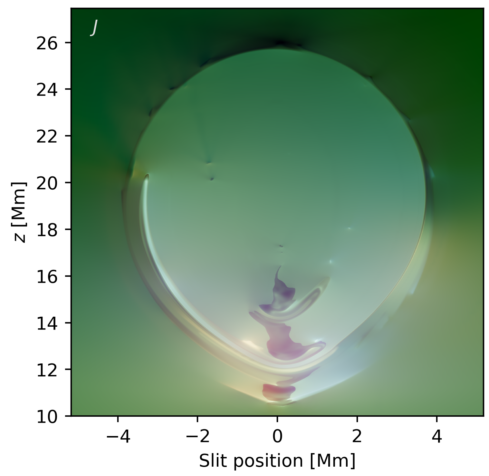

# DexRT: A GPU-Accelerated Non-LTE Radiative Transfer Code Based on Radiance Cascades

|   |   |   |   |
|---|---|---|---|
| __Maintainer__ | Chris Osborne | __Institution__ | University of Glasgow  |
| __License__ |  | | |

Description
-----------

DexRT is a modern, in-development, non-LTE predominantly solar radiative transfer code intended for studying the formation of atomic spectral lines in multidimensional atmospheres with complex structure, such as solar prominences.
Currently 2D (with additional third invariant axis) models are supported.
The calculation of the radiation field through the atmosphere is performed by a novel technique known as [Radiance Cascades](https://github.com/Raikiri/RadianceCascadesPaper), avoiding the ray effects that plague short characteristics solvers on problems that have complex mixed optically-thin and thick structure.

Atomic data is provided in the [CRTAF](https://github.com/Goobley/CommonRTAtomicFormat) format, a nascent potential-standard for interoperation between non-LTE codes.

Please forgive the current state of the repository, it will be tidied up soon™.

Non-exhaustive feature list:
- GPU accelerated
- Radiance cascades formal solution in 2D
- Non-LTE solution via same-preconditioning MALI (Rybicki & Hummer 1992)
- Electron density charge conservation (secondary Newton-Raphson, e.g. Heinzel 1995, Osborne & Milic 2021)
- Pressure conservation a la [Promweaver](https://github.com/Goobley/Promweaver)
- `dexrt_ray`: a single-pass final formal solver allowing for calculation of intensity and formation properties such as contribution function from arbitrary angles.
- Docker container specifications provided in `.devcontainer` that have been tested (primarily nvhpc). These environments can be worked from directly with VSCode.

📖 Documentation
----------------

Documentation is thin on the ground currently, please see the [paper](https://arxiv.org/abs/2408.14425), doxygen strings in some files, and the tests.
Please ask if things are unclear.

⬇ Installation
--------------

Docker container specifications are available in `.devcontainer`. The most tested option is nvhpc, but the code, via [YAKL](https://github.com/mrnorman/YAKL) should be adaptable to all major GPU vendors.
Feel free to get in touch if trying to run this on different hardware.

The code now requires [kokkos](https://github.com/kokkos/kokkos) and [kokkos-kernels](https://github.com/kokkos/kokkos-kernels). There are scripts to set up local installations of these in `docker_deps/kokkos*`. This is not currently done automatically during devcontainer construction.
These libraries can then be provided to the compile setup through the use of `CMAKE_PREFIX_PATH` and `Kokkos_ROOT`. See `build/cmake_docker_nompi.sh` as an example.

🤝 Contributing
---------------

We would love for you to get involved.
Please report any bugs encountered on the GitHub issue tracker.

If you are interested in adding a feature, please reach out, even if to say "I'm not sure if this is a good idea"!
We can then determine the best way to go about the feature, and whether it's already on the core roadmap.

We require all contributors to abide by the [code of conduct](CODE_OF_CONDUCT.md).

